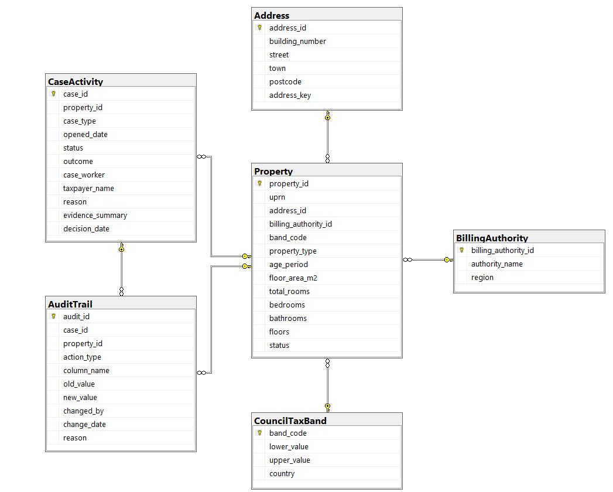

# Council Tax Case Management System

A Microsoft SQL Server database that models a simplified Council Tax case management system used to support property valuation, case investigations, and Council Tax band administration.

The project demonstrates relational database design, data loading, analytical SQL queries, and audit logging.

---

## Overview

The system manages residential property records together with structured addresses, billing authorities, Council Tax bands, case activities, and historical audit information.

It supports common operational activities including:

- analysing comparable properties
- reporting Council Tax band distribution
- identifying duplicate records
- validating property updates
- maintaining an audit trail of property changes

---

## Database Design

The database consists of six relational tables.

| Table | Description |
|--------|-------------|
| **BillingAuthority** | Stores local billing authority information. |
| **CouncilTaxBand** | Defines Council Tax bands and valuation ranges. |
| **Address** | Stores structured addresses and generates a standardised `address_key` for duplicate detection. |
| **Property** | Stores the primary property record together with valuation attributes. |
| **CaseActivity** | Records investigations, reviews, updates and challenge activities. |
| **AuditTrail** | Records historical changes made to property records. |

### Entity Relationship Diagram

    

---

## Functional Requirements

The implemented SQL solutions support the following business functions.

| ID | Function |
|----|----------|
| A | Identify similar properties within the same Council Tax band. |
| B | Produce property counts by Billing Authority and Council Tax band. |
| C | Generate standard property correspondence letterheads. |
| D | Compare properties within ±10% floor area. |
| E | Detect duplicate addresses and maintain an audit trail. |
| F | Process valid property updates through business events and case activity. |
| G | Support Council Tax band review investigations using comparable evidence. |

---

## Technologies

- Microsoft SQL Server
- SQL Server Management Studio (SSMS)
- SQL

---

## SQL Concepts

- Relational database modelling
- Primary and foreign keys
- Constraints
- Computed columns
- BULK INSERT
- Joins
- Subqueries
- Common Table Expressions (CTEs)
- Window functions
- Aggregate functions
- CASE expressions
- Data validation
- Audit logging

---

## Running the Project

1. Execute `schema.sql` to create the database schema.
2. Update the CSV file paths in `load.sql`.
3. Execute `load.sql` to populate the database.
4. Run the individual task scripts to reproduce each business requirement.

---

## Project Scope

The solution models a simplified Council Tax case management workflow designed for educational purposes. It focuses on SQL implementation, reporting, and case management processes rather than full production functionality.
